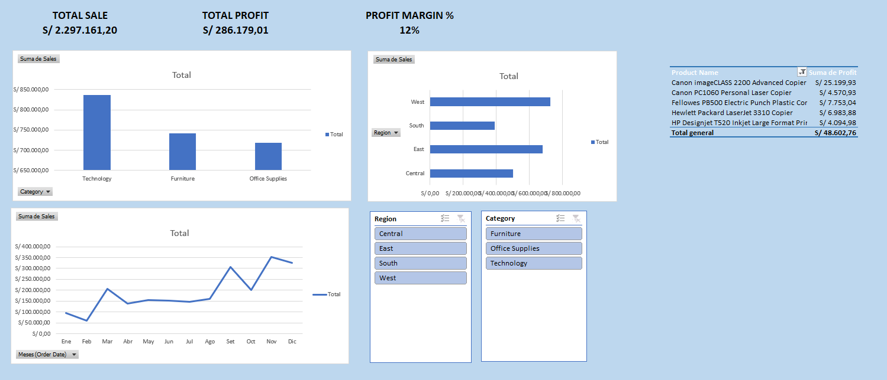

# Sales & Commercial Profitability Dashboard

Interactive sales and profitability dashboard developed in Excel to analyze commercial performance across categories, regions, products and time.

## Business Problem

The objective of this project was to consolidate sales and profitability information into an interactive dashboard that allows commercial performance to be analyzed from different perspectives.

## Objective

Develop an executive dashboard in Excel to monitor sales, profit and profit margin while enabling analysis by category, region, product and month.

## Data

The project uses the Sample Superstore dataset, containing transactional sales data across products, categories, regions and order dates.

## Data Preparation

The dataset was prepared in Excel to support the analysis and dashboard construction.

Power Query was used to automate data consolidation and refresh processes, while calculated fields were created to support profitability and time-based analysis.

## Key Performance Indicators

The dashboard includes:

- Total Sales
- Total Profit
- Profit Margin %
- Sales by Category
- Sales by Region
- Monthly Sales
- Top Products by Profit

## Analysis

The dashboard provides several views of commercial performance:

- Sales by category
- Sales by region
- Monthly sales evolution
- Profitability by product
- Interactive filtering by region and category

## Dashboard

### Executive Dashboard

## Key Findings

- Technology generates the highest total sales among the three categories.
- The West region records the highest sales among the regions shown.
- Sales show noticeable variation throughout the year, with stronger performance toward the final months.
- The dashboard identifies the products generating the highest levels of profit.

## Business Takeaways

The analysis provides a consolidated view of commercial performance and helps identify differences across categories, regions, products and time periods.

The interactive structure allows users to explore performance from different commercial perspectives without rebuilding the report manually.

## Tools

- Microsoft Excel
- Power Query
- PivotTables
- Interactive Slicers
